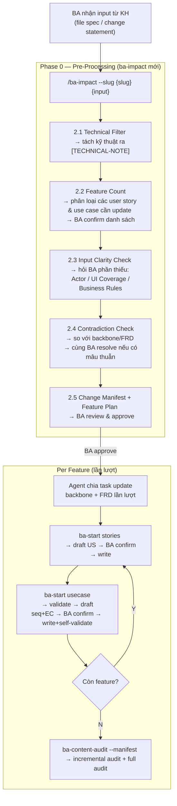

# Báo cáo Đề xuất Tối ưu hóa BA-kit & Workflow

*Tài liệu dành cho Quản lý dự án / BA Lead nhằm định hướng tái cấu trúc hệ thống tài liệu và chuẩn hóa quy trình áp dụng AI.*

## Changelog

| Version | Ngày | Nội dung |
|---|---|---|
| v1 | 2026-07 | Báo cáo ban đầu — đề xuất tách `ba-absorb` thành lệnh riêng biệt song song với `ba-impact` |
| v2 | 2026-08-05 | Sau khi nghiên cứu sâu BA-kit: xác định luồng hiện tại đã khá khép kín — tách lệnh tạo overhead không cần thiết. Tích hợp toàn bộ logic filter/absorption vào Phase 0 của `ba-impact`. Bổ sung `ba-start usecase` (add new), tăng cường `ba-start stories` và `ba-content-audit`. |

---

## 0. Bối cảnh

Qua quá trình chạy thực tế dự án, một thay đổi yêu cầu sự kiểm soát trên 6 loại tài liệu (ASCII, Backbone, User Story, Use Case, FRD, SRS). Mỗi file đảm nhận một vai trò, tuy nhiên **nội dung lại bị trùng lặp ở quá nhiều nơi**, gây khó khăn rất lớn cho BA trong việc đối chiếu và quản lý tính chính xác của output.

Kiểm tra ngẫu nhiên 2 line nghiệp vụ, cả 2 đều không giữ được chuẩn cấu trúc BA-kit:
- **Line 1:** Template FRD bị phá vỡ hoàn toàn do AI "hấp thụ" spec kỹ thuật sâu, lấn át format BA.
- **Line 2:** Template FRD bị AI tự bổ sung phần "Functional Requirement" (nội dung y hệt SRS) dù chuẩn gốc không có.

**Nguyên nhân dự đoán:**
1. **BA chưa nắm rõ cấu trúc BA-kit** → không kiểm soát và định hướng đúng cho output do AI sinh ra.
2. **Quá tải thông tin ở công cụ AI (`ba-impact`)** → lệnh `ba-impact` đang phải gánh quá nhiều task cùng lúc (vừa absorb spec mới, vừa quét ảnh hưởng chéo toàn hệ thống), khiến AI dễ bịa nội dung (hallucinate) và miss requirement.

**👉 Mục tiêu:** Thiết lập **nguồn thông tin tập trung (SSOT) với ranh giới rõ ràng** để BA dễ quản lý output, Dev/QC và toàn team dễ đọc và maintain.

---

## 1. Tối ưu cấu trúc BA-kit (Template Optimization)

### 1.1. Quan sát về cấu trúc BA-kit hiện tại (Observations)

Trong quá trình triển khai thực tế, team nhận thấy một số điểm giao thoa giữa các template, dẫn đến việc thông tin có xu hướng xuất hiện ở nhiều nơi:

**Sự giao thoa ở FRD:**
- Mục "Performance Requirements" có nội dung tương đồng với NFR trong SRS. Tương tự, "Integration Points" có phần lặp với mục API của SRS.
- "Business Rules" thường có xu hướng được chép lại từ Backbone, và "AC" lặp lại nội dung của User Story.
- "Workflows" hiện chưa quy định rõ ranh giới (scope note) nên đôi khi bị vẽ trùng luồng với sơ đồ trong Use Case hoặc SRS.

**Sự giao thoa ở SRS Spec:**
- Mục "Functional Requirements" khi đưa cho AI phân tích thường bị hiểu thành liệt kê tính năng, dẫn đến việc lặp lại danh sách Use Case ở phần dưới.
- "Business Rules" cũng dễ bị chép lại từ Backbone, trong khi "Data Constraints" dễ trùng lặp với mục Data Requirements của FRD.

**Luồng nghiệp vụ xuất hiện ở nhiều tài liệu:**
Cùng một luồng xử lý nhưng hiện tại có thể được mô tả ở FRD (Activity diagram), SRS (DFD), và UC (Sequence diagram). Điều này hoàn toàn không sai về mặt kỹ thuật, tuy nhiên nếu **chưa có quy ước ranh giới rõ ràng**, AI và BA dễ vẽ trùng lặp nội dung. Khi nghiệp vụ thay đổi, team sẽ tốn nhiều effort hơn để bảo trì và đồng bộ hóa cả 3 sơ đồ này.

### 1.2. Nguyên tắc thiết kế mới

1. **SSOT**: Mỗi nội dung chỉ viết đầy đủ **1 lần**. File khác chỉ trỏ bằng Link/ID.
2. **Đồng bộ User Story & Use Case** (giữ tách file, phân vai trò rõ):
   - *Story Statement*: Viết gốc ở US. UC chỉ copy y nguyên khi elaborate.
   - *AC*: Nguồn đầy đủ ở luồng Flow của UC. US chỉ chứa bản rút gọn (1 dòng/step) cho QC check nhanh.
   - *Điều hướng*: US và UC dùng chung số thứ tự ở tên file (vd: `uc-01...` ↔ `us-01...`).
3. **Scope Note cho Diagram**:
   - *FRD Workflow*: Chỉ vẽ luồng tổng thể cross-role.
   - *UC Sequence*: Chỉ vẽ tương tác cục bộ actor ↔ system trong 1 UC.
   - *SRS DFD*: Chỉ vẽ luồng dữ liệu hệ thống ↔ hệ thống.
4. **Common Rules ≠ AC**: Common Rules áp dụng cho ≥ 2 features. AC chỉ apply cho 1 feature → tuyệt đối không nhét AC vào bảng Common Rules.

### 1.3. Chi tiết thay đổi

**1. Requirements Backbone**
| Thay đổi | Lý do |
|---|---|
| Gộp 3 bảng "Feature Map", "Functional Backbone", "Story Map" thành **1 bảng duy nhất**. | Tránh 3 phiên bản lệch nhau. Bỏ tầng ID `FR-*` thừa. |
| Đảo thứ tự: "Danh sách module" lên đầu. | Đúng phân cấp: Portal → Module → Feature → UC. |
| Bỏ "Tính năng bao phủ", thêm "Linked Module" ở Feature Map. | Tránh trace 2 chiều làm lệch dữ liệu. |

**2. FRD**
FRD được hiểu ở đây là file để khách hàng/ PO/PM nhanh chóng nắm được context **business** dự án. Tất cả thay đổi sẽ phục vụ mục tiêu này.  
| Thay đổi | Lý do |
|---|---|
| Thêm frontmatter: `linked_srs`, `backbone_ref`. | Tham chiếu tường minh cho Dev. |
| "Feature List" → bảng auto-filter từ Backbone. | FRD chỉ tổng hợp, không tự sinh data. |
| Xóa "Yêu cầu dữ liệu" & "Yêu cầu hiệu năng". | Data & NFR thuộc SRS. |
| "Business Rules" → bảng tham chiếu (Link). | Rule text chỉ nằm ở Backbone. |
| Xóa "Tiêu chí chấp nhận (AC)". | AC đầy đủ ở UC Flow; bản rút gọn ở US. |
| "Luồng nghiệp vụ" bổ sung scope note (chỉ vẽ tổng quan về tương tác hệ thống/ đổi thành use case diagram) | Tránh vẽ trùng với UC và SRS. |

**3. Use Case**
| Thay đổi | Lý do |
|---|---|
| Thêm `feature_ref` ở frontmatter; xóa "## Trace" ở body. | Tránh lặp trace dễ gây lệch. |
| UC và US dùng chung số thứ tự tên file. | Tra cứu 2 chiều nhanh. |
| Sequence Diagram: bổ sung scope note. | Chỉ vẽ phạm vi 1 UC. |

**4. User Story**
| Thay đổi | Lý do |
|---|---|
| Giữ nguyên frontmatter gốc. | Không thêm field mới ở giai đoạn này. |
| Bổ sung ghi chú: Story Statement viết TRƯỚC, AC viết SAU (rút gọn từ UC). | AC luôn bắt nguồn từ UC, không tự viết mới. |
| Bổ sung ghi chú điều hướng chung số thứ tự với UC. | Tra cứu 2 chiều nhanh. |
| Bỏ "## Trace" ở body. | Trace đủ ở frontmatter; body dính ID lỗi thời (`FR-*`). |

**5. SRS Spec**
SRS được hiểu ở đây là file để Dev/QC nhanh chóng nắm được context **kỹ thuật** dự án. Tất cả thay đổi sẽ phục vụ mục tiêu này.  
| Thay đổi | Lý do |
|---|---|
| Thêm frontmatter: `frd_ref`. | Khép kín tham chiếu chéo với FRD. |
| Xóa "Functional Requirements". | Trỏ sang FRD; dùng UC ID làm mã yêu cầu. |
| "Business Rules" → bảng tham chiếu. | Rule text thuộc Backbone. |
| Giữ nguyên "Data Constraints". | SSOT cho đặc tả dữ liệu. |

**6. SRS Compiled**
| Thay đổi | Lý do |
|---|---|
| Bảng "Use Cases": thêm cột "US Ref" trỏ tới User Story. | PM/QC click thẳng vào US xem checklist. |
| Xóa bảng "Functional Requirements". | Bỏ tầng ID `FR-*` toàn dự án. |
| Thêm link "Tham chiếu FRD" ở đầu file. | Bối cảnh business mà không copy lại. |
| DFD: bổ sung scope note. | Chỉ vẽ luồng data, không vẽ hành động. |

---

## 2. Tối ưu Workflow — Full Flow & Suggestions

### 2.1. Bối cảnh & Vấn đề

Thực tế cho thấy lệnh `/ba-impact` khi vừa absorb spec mới vừa quét ảnh hưởng chéo cùng lúc → AI sinh Use Case nông, chung chung, thậm chí miss requirement. Ngược lại, khi tách cho AI xử lý từng phần riêng thì không bị miss.

**Mục tiêu:** Human verify mọi output AI tạo ra. Tối ưu input để AI không tiếp thu thông tin thừa. Tối ưu output để BA verify kỹ càng.

### 2.2. Full Flow (Human-in-the-loop)



### 2.3. Chi tiết từng bước

#### Bước 1 — BA import requirement

BA đưa file spec của KH vào thư mục project. Chạy lệnh:
```
/ba-impact --slug {slug} {đường dẫn file hoặc change statement}
```

---

#### Bước 2 — Pre-Processing (`ba-impact` ver update)

> **File tham chiếu:** [`ba-impact-SKILL.md`](../01_BA_Kit_Templates_Moi/ba-impact-SKILL.md) — MODIFY từ `skills/ba-impact/SKILL.md`
>
> **Current state:** Skill read-only, chỉ phân tích impact và trả về recommended commands. BA phải tự tạo manifest theo template — skill không tự sinh file manifest, không breakdown chi tiết section nào thay đổi, source từ đâu, tag client-spec hay BA-inferred. Không có checkpoint để BA verify trước khi apply.
>
> **Phần modify:** Thêm Phase 0 (5 bước pre-processing) chạy trước impact workflow hiện tại. Thêm Phase 2 (tự động chuyển sang stories/usecase sau khi update xong backbone/FRD).
>
> **Mục đích:** AI chỉ nhận business requirement đã lọc, đủ thông tin, không còn contradiction trước khi phân tích impact. BA verify manifest trước khi bất kỳ file nào bị thay đổi.

**Bước 2.1 — Technical Filter:**
Scan toàn bộ input, flag nội dung kỹ thuật (tên cột DB, API endpoint, framework, SDK...) vào block `[TECHNICAL-NOTE]` tách biệt. Không đưa vào FRD/Backbone. Báo ngắn gọn cho BA, rồi tiếp tục với phần business còn lại.

**Bước 2.2 — Feature Count:**
Phân loại thay đổi thành feature mới / feature cần update. Xuất danh sách để BA confirm trước khi đi sâu.

**Bước 2.3 — Input Clarity Check:**
Với từng feature, kiểm tra đủ 3 yếu tố: **Actor** (cụ thể, không chung chung), **UI Coverage** (có màn hình không, đã đủ trạng thái chưa), **Business Rules** (điều kiện trigger, constraint, edge case). Thiếu yếu tố nào → hỏi BA phần đó, không đoán.

**Bước 2.4 — Contradiction Check:**
So proposed changes với rules hiện tại trong backbone và FRD. Nếu có mâu thuẫn → liệt kê rõ và cùng BA resolve trước khi tiếp tục. Ghi lại kết quả resolve để đưa vào manifest.

**Bước 2.5 — Change Manifest + Feature Plan:**
Tạo 1 file duy nhất gồm 2 phần:
- **Change Manifest** (theo [`change-manifest-template.md`](../02_BA_Absorption_Filter/change-manifest-template.md)): liệt kê chính xác file nào thay đổi, section nào, loại thay đổi ADD/UPDATE/DELETE, source ref — chỉ cho backbone + FRD, chưa đi sâu vào US/UC.
- **Feature Plan** (section `## Feature Plan` ở cuối manifest): danh sách US/UC cần tạo/sửa cho từng feature.

Lưu tại: `plans/{slug}-{date}/shared/manifests/CM-{YYMMDD}-{HHMM}-{source-slug}.md`
⚠️ Thư mục `shared/manifests/` phải được gitignore — không commit lên PR hoặc main.

Hiển thị toàn bộ manifest + feature plan cho BA review. **BA approve → tiếp tục.**

---

#### Bước 3 — Agent update Backbone + FRD

> **File tham chiếu:** [`ba-impact-SKILL.md`](../01_BA_Kit_Templates_Moi/ba-impact-SKILL.md) — Phase 1 (giữ nguyên impact workflow gốc)
>
> **Current state:** ba-impact khi detect thay đổi sẽ recommend update toàn bộ artifact chain (backbone, FRD, US, UC) — về mặt kỹ thuật có thể thực hiện hết trong 1 lần.
>
> **Phần modify:** Tách thành 3 bước riêng (Bước 3: backbone+FRD / Bước 4: stories / Bước 5: usecase) với checkpoint BA confirm ở mỗi output. Không thay đổi logic impact workflow, chỉ giới hạn scope, thêm yêu cầu human verify của từng bước và thêm auto-handoff sang bước tiếp theo sau khi xong.
>
> **Mục đích:** Control change output theo nguyên tắc HITL (Human-In-The-Loop) — mỗi bước AI chỉ làm 1 loại artifact, BA verify và confirm trước khi đi tiếp. Không phải vì ba-impact không làm được, mà để đảm bảo BA không bỏ sót lỗi khi output quá lớn.

Sau khi BA approve manifest, agent **tự chia task và thực hiện lần lượt** các thay đổi trong manifest — không hỏi thêm trừ khi phát hiện thiếu thông tin trong quá trình update. Thứ tự: backbone trước, FRD sau (đúng luồng chảy dữ liệu từ trên xuống).

Scope bước này chỉ là backbone + FRD. US và UC được tách sang Bước 4/5 để BA có checkpoint riêng confirm từng output trước khi write.

---

#### Bước 4 — Viết User Story (per feature)

> **File tham chiếu:** [`stories.md`](../01_BA_Kit_Templates_Moi/stories.md) — MODIFY từ `skills/ba-start/steps/stories.md`
>
> **Current state:** Có Backbone Authority Gate + Governance Gate (rerun check). Skill đọc backbone/FRD trước khi generate, nhưng không có info-sufficiency check để hỏi BA những gì còn thiếu trước khi draft — AI generate thẳng rồi write file, không có confirm loop.
>
> **Phần modify:** Thêm Sub-step 7.0 (info-sufficiency gate: đọc backbone/FRD trước, chỉ hỏi BA phần còn thiếu), Sub-step 7.1 (draft → confirm loop không giới hạn → write), Sub-step 7.2 (handoff prompt sang usecase).
>
> **Mục đích:** BA verify từng US trước khi ghi file — đảm bảo Role/Action/Benefit đủ và đúng.

Sau khi ba-impact update backbone + FRD + các file liên quan, agent tự gọi skill ba-start stories (như ba-kit đang làm hiện tại). (proposal chỉ modify ba-start stories SKILL)

Agent tự bắt đầu từ Feature 1 trong Feature Plan mà không cần BA gõ lệnh thêm. Với mỗi feature:

**Info-Sufficiency Gate:** Kiểm tra đủ 3 yếu tố trước khi draft:
- **Role:** Ai là người dùng? (cụ thể)
- **Action:** Họ muốn làm gì? (động từ + đối tượng cụ thể)
- **Benefit:** Lợi ích business là gì?

Thiếu yếu tố nào → hỏi BA trước. Đủ rồi → draft story trong chat → BA confirm (không giới hạn vòng iterate) → write file.

Sau khi write xong: hỏi BA có muốn tiếp tục gen Use Case không (`Y/n`).

---

#### Bước 5 — Viết Use Case (per feature)

> **File tham chiếu:** [`usecase.md`](../01_BA_Kit_Templates_Moi/usecase.md) — ADD NEW, target `skills/ba-start/steps/usecase.md`
> **Template:** [`usecase-item-template.md`](../usecase-item-template.md) | **Edge case analysis:** [`seq-to-ec-template.md`](../02_BA_Absorption_Filter/seq-to-ec-template.md)
> **Current state:** Không tồn tại — hiện tại không có step tạo UC trong ba-start. UC phải viết tay hoặc ngoài flow tự động.
> **Phần modify (add new):** 5 sub-steps: UC-1 validate input (Actor/Preconditions/Trigger/Flows, hỏi BA phần còn thiếu) → UC-2 draft Mermaid sequence + Break Point Analysis → EC grouping → UC-3 confirm loop không giới hạn → UC-4 write+self-validate → UC-5 handoff.
> **Mục đích:** Lấp khoảng trống trong luồng, đảm bảo UC có đủ chất lượng (sequence diagram, edge cases, self-validate checklist) trước khi write file.

**UC-1 Validate Input:** Kiểm tra đủ thông tin để điền template: Actor, Preconditions, Trigger, Main Flow (đủ bước để mô tả toàn bộ tương tác actor↔system từ trigger đến postcondition), Alternate Flows, Error Flows, Postconditions. Thiếu → hỏi BA phần đó.

**UC-2 Draft Sequence + Edge Cases:**
- Sau khi ghi nhận đủ thông tin 
- Vẽ Mermaid sequence diagram (main flow + alternate flows)
- Phân tích Break Points theo `seq-to-ec-template.md §2`: mỗi interaction line có thể gãy ở đâu, root cause, error message, severity -> Group thành Edge Cases (`EC-{MODULE}-{NNN}`)
- Show toàn bộ draft trong chat để BA xem

**UC-3 Confirm:** BA confirm (không giới hạn vòng) → write file.

**UC-4 Write + Self-validate:** Write `usecases/uc-{slug}.md` theo template. Tự check đủ sections, sau đó báo kết quả: PASS / WARN / FAIL.

**UC-5 Handoff:** Nếu còn feature → bắt đầu feature tiếp theo. Nếu xong hết → hỏi BA có muốn chạy audit không.

---

#### Bước 6 — Audit sau khi xong tất cả features

> **File tham chiếu:** [`ba-content-audit-SKILL.md`](../01_BA_Kit_Templates_Moi/ba-content-audit-SKILL.md) — MODIFY từ `skills/ba-content-audit/SKILL.md`
>
> **Guideline:** `audit-guideline-post-update.md`
>
> **Current state:** Chỉ có full audit mode (toàn bộ project), tập trung format và traceability — không check content correctness, không so sánh plan vs reality.
>
> **Phần modify:** Thêm `--manifest <path>` argument + Step 3a Incremental Audit mode chạy trước full audit (Layer 1 Completeness, Layer 2 Consistency, Layer 3 Correctness). `git diff {baseline_sha}...HEAD` so với SHA ghi trong manifest, không phụ thuộc main.
>
> **Mục đích:** Audit đúng phần đã thay đổi, bổ sung correctness check (ACs measurable, business rules nhất quán, flow không conflict giữa features).

```
/ba-content-audit --slug {slug} --manifest plans/{slug}-{date}/shared/manifests/CM-{date}-{slug}.md
```

**Incremental Audit (chạy trước):** Đọc Change Manifest (kế hoạch) + `git diff {baseline_sha}...HEAD` (thực tế, trong đó `baseline_sha` được lưu vào manifest lúc tạo — là SHA commit ngay trước khi bắt đầu apply thay đổi) → so sánh plan vs reality:
- **Layer 1 — Completeness:** File nào planned nhưng chưa update? File nào thay đổi ngoài kế hoạch?
- **Layer 2 — Consistency:** Traceability chain (Backbone → FRD → US → UC), cross-check US↔UC pairs, terminology nhất quán
- **Layer 3 — Correctness:** ACs có measurable không? Có conflict giữa features không? Diagrams sync với text không?

**Full Audit (chạy sau):** Scan toàn bộ artifacts như bình thường.

---

### 2.4. Tổng hợp Suggestions (Changes to BA-kit)

| File | Loại | Thay đổi chính | Target |
|---|---|---|---|
| [`ba-impact-SKILL.md`](../01_BA_Kit_Templates_Moi/ba-impact-SKILL.md) | MODIFY | Thêm Phase 0 (5 bước pre-processing: Technical Filter → Feature Count → Input Clarity Check → Contradiction Check → Change Manifest + Feature Plan tự động với breakdown source/section/tag) + Phase 2 (tự động chuyển sang stories/usecase sau update xong backbone/FRD) | `skills/ba-impact/SKILL.md` |
| [`stories.md`](../01_BA_Kit_Templates_Moi/stories.md) | MODIFY | Giữ nguyên Backbone Authority Gate + Governance Gate. Thêm Sub-step 7.0 (info-sufficiency gate: đọc backbone/FRD trước, hỏi BA phần còn thiếu) + Sub-step 7.1 (draft → confirm loop không giới hạn → write) + Sub-step 7.2 (handoff prompt sang usecase) | `skills/ba-start/steps/stories.md` |
| [`usecase.md`](../01_BA_Kit_Templates_Moi/usecase.md) | ADD NEW | File mới, 5 sub-steps: validate input (Actor/Preconditions/Trigger/Flows) → draft Mermaid sequence + Break Point Analysis → EC grouping → BA confirm loop → write+self-validate → handoff | `skills/ba-start/steps/usecase.md` |
| [`ba-content-audit-SKILL.md`](../01_BA_Kit_Templates_Moi/ba-content-audit-SKILL.md) | MODIFY | Thêm `--manifest` argument + Step 3a Incremental Audit mode (Layer 1 Completeness, Layer 2 Consistency, Layer 3 Correctness). `git diff {baseline_sha}...HEAD` — SHA từ manifest, không phụ thuộc main | `skills/ba-content-audit/SKILL.md` |

**Notes chung:**
- `shared/manifests/` phải gitignore — chỉ lưu local, không commit.
- `ba-content-audit` incremental mode dùng `git diff {baseline_sha}...HEAD` — SHA được ghi vào manifest lúc tạo (trạng thái trước khi apply thay đổi), không phụ thuộc vào `main` hay bất kỳ branch nào khác.
- Stories và Use Case: info-sufficiency gate đọc backbone/FRD trước, chỉ hỏi BA phần còn thiếu. Confirm loop không giới hạn số vòng.

---

## 3. Open Questions for Manager

1. **Vị trí lưu trữ Open Questions (OQ)**
   - *Thực trạng:* Trong dự án hiện tại, các OQ đang được tập hợp hết vào Spec chung (ưu điểm: tập trung, dễ theo dõi tiến độ giải quyết). Tuy nhiên, template BA-kit mới đề xuất đặt OQ vào ngay bên trong file Use Case tương ứng (ưu điểm: giữ nguyên bối cảnh context, giúp team dev/QC và AI dễ hiểu nhất mà không phải trace ngược lại SRS).
   - *Câu hỏi:* Vậy dự án nên chốt phương án lưu trữ OQ ở đâu để tối ưu nhất cho cả BA (quản lý OQ) lẫn Dev/QC/AI (đọc hiểu spec)?

---

## 4. Tài liệu tham khảo & Template đính kèm

### 4.1. Bộ BA Absorption Filter (Middleware Scripts)
- **[`ba-absorption-filter.md`](../02_BA_Absorption_Filter/ba-absorption-filter.md)**: Ruleset cốt lõi — ranh giới AI, chính sách lọc kỹ thuật, 7 bước phân tích luồng.
- **[`absorb.md`](../02_BA_Absorption_Filter/absorb.md)**: Workflow Giai đoạn 1 (`/ba-absorb`) — đọc spec, lọc tech, vẽ Sequence, sinh Edge Cases, xuất Proposal.
- **[`change-manifest-template.md`](../02_BA_Absorption_Filter/change-manifest-template.md)**: Template chuẩn cho báo cáo Change Manifest.
- **[`seq-to-ec-template.md`](../02_BA_Absorption_Filter/seq-to-ec-template.md)**: Template phân tích Break Points từ Sequence → bảng Edge Cases (`EC-{MOD}-{NNN}`).

### 4.2. Bộ BA-kit Templates (Đã tối ưu)
- Các file template đã sửa đổi theo đề xuất Mục 1.3 (Backbone, FRD, UC, US, SRS Spec, SRS Compiled).
- Vị trí: `../01_BA_Kit_Templates_Moi/`

**Files thay đổi skill (v2 — tích hợp workflow):**
- **[`ba-impact-SKILL.md`](../01_BA_Kit_Templates_Moi/ba-impact-SKILL.md)**: MODIFY — thêm Phase 0 (5 bước pre-processing) + Feature Plan section. Target: `skills/ba-impact/SKILL.md`.
- **[`stories.md`](../01_BA_Kit_Templates_Moi/stories.md)**: MODIFY — thêm info-sufficiency gate, draft→confirm loop (không giới hạn), handoff prompt sang usecase. Target: `skills/ba-start/steps/stories.md`.
- **[`usecase.md`](../01_BA_Kit_Templates_Moi/usecase.md)**: ADD NEW — 5 sub-steps: validate → draft sequence+EC → confirm → write+self-validate → handoff. Target: `skills/ba-start/steps/usecase.md`.
- **[`ba-content-audit-SKILL.md`](../01_BA_Kit_Templates_Moi/ba-content-audit-SKILL.md)**: MODIFY — thêm `--manifest` argument, Incremental Audit mode (Layer 1-3), tích hợp `audit-guideline-post-update.md`. Target: `skills/ba-content-audit/SKILL.md`.

---

## 5. Tổng kết (Conclusion)

Toàn bộ bản đề xuất giải pháp này được xây dựng xoay quanh **mục tiêu cốt lõi**:

> **Human verify mọi output AI tạo ra.** Mỗi bước AI làm xong đều có checkpoint để BA xem và confirm trước khi đi tiếp.

Để đạt được mục tiêu đó, hai nguyên tắc kỹ thuật được áp dụng:
1. **Tối ưu input**: AI chỉ nhận thông tin cần thiết cho từng bước — không đọc lại toàn bộ lịch sử, không xử lý kỹ thuật lẫn nghiệp vụ cùng lúc.
2. **Tối ưu output**: Mỗi bước AI ra output đủ nhỏ để BA đọc và verify được — draft story, draft UC, manifest trước khi apply, audit sau khi xong.

*(Đề xuất này có thể còn thiếu sót. Rất mong Manager xem xét, cân nhắc để tinh chỉnh sao cho phù hợp nhất với thực tế dự án.)*
