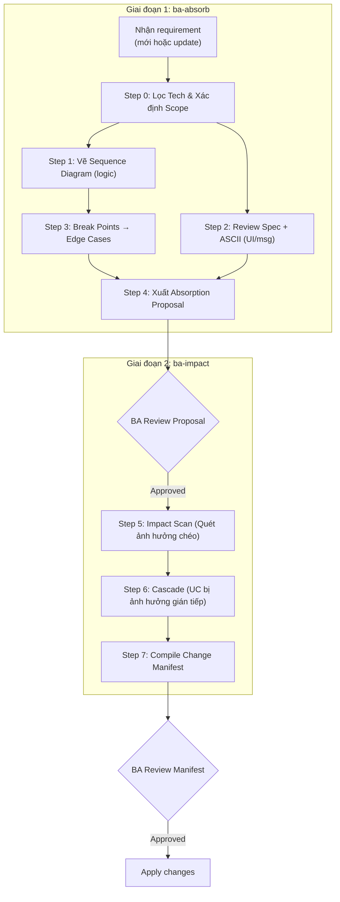

# Báo cáo Đề xuất Tối ưu hóa BA-kit & Workflow

*Tài liệu dành cho Quản lý dự án / BA Lead nhằm định hướng tái cấu trúc hệ thống tài liệu và chuẩn hóa quy trình áp dụng AI.*

---

## 0. Bối cảnh

Qua quá trình chạy thực tế dự án, một thay đổi yêu cầu sự kiểm soát trên 6 loại tài liệu (ASCII, Backbone, User Story, Use Case, FRD, SRS). Mỗi file đảm nhận một vai trò, tuy nhiên **nội dung lại bị trùng lặp ở quá nhiều nơi**, gây khó khăn rất lớn cho BA trong việc đối chiếu và quản lý tính chính xác của output.

Kiểm tra ngẫu nhiên 2 line nghiệp vụ, cả 2 đều không giữ được chuẩn cấu trúc BA-kit:
- **Line 1:** Template FRD bị phá vỡ hoàn toàn do AI "hấp thụ" spec kỹ thuật sâu, lấn át format BA.
- **Line 2:** Template FRD bị AI tự bổ sung phần "Functional Requirement" (nội dung y hệt SRS) dù chuẩn gốc không có.

**Nguyên nhân dự đoán:**
1. **BA chưa nắm rõ cấu trúc BA-kit** → không kiểm soát và định hướng đúng cho output do AI sinh ra.
2. **Quá tải thông tin ở công cụ AI (`ba-impact`)** → lệnh `ba-impact` đang phải gánh quá nhiều task cùng lúc (vừa absorb spec mới, vừa quét ảnh hưởng chéo toàn hệ thống), khiến AI dễ bịa nội dung (hallucinate) và miss requirement.

**👉 Mục tiêu:** Thiết lập **nguồn thông tin tập trung (SSOT) với ranh giới rõ ràng** để BA dễ quản lý output, Dev/QC và toàn team dễ đọc và maintain.

---

## 1. Tối ưu cấu trúc BA-kit (Template Optimization)

### 1.1. Vấn đề tồn đọng

**FRD** bị "blend" nghiêm trọng nhất:
- "Performance Requirements" trùng SRS §NFR. "Integration Points" lặp SRS §API.
- "Business Rules" chép lại Backbone. "AC" lặp lại User Story.
- "Workflows" không có scope note → vẽ trùng luồng với UC và SRS.

**SRS Spec:**
- "Functional Requirements" bị AI hiểu thành liệt kê tính năng → lặp nguyên xi danh sách UC bên dưới.
- "Business Rules" lại chép lại từ Backbone. "Data Constraints" dễ lặp với FRD "Data Requirements".

**Luồng nghiệp vụ bị vẽ ở 3 nơi:**
Cùng 1 luồng xử lý nhưng xuất hiện ở FRD (Activity diagram), SRS (DFD), và UC (Sequence diagram). Không sai về kỹ thuật, nhưng vì **thiếu quy ước ranh giới**, AI và người viết dễ vẽ trùng lặp. Khi nghiệp vụ đổi, rủi ro 3 sơ đồ lệch nhau là rất cao.

### 1.2. Nguyên tắc thiết kế mới

1. **SSOT**: Mỗi nội dung chỉ viết đầy đủ **1 lần**. File khác chỉ trỏ bằng Link/ID.
2. **Đồng bộ User Story & Use Case** (giữ tách file, phân vai trò rõ):
   - *Story Statement*: Viết gốc ở US. UC chỉ copy y nguyên khi elaborate.
   - *AC*: Nguồn đầy đủ ở luồng Flow của UC. US chỉ chứa bản rút gọn (1 dòng/step) cho QC check nhanh.
   - *Điều hướng*: US và UC dùng chung số thứ tự ở tên file (vd: `uc-01...` ↔ `us-01...`).
3. **Scope Note cho Diagram**:
   - *FRD Workflow*: Chỉ vẽ luồng tổng thể cross-role.
   - *UC Sequence*: Chỉ vẽ tương tác cục bộ actor ↔ system trong 1 UC.
   - *SRS DFD*: Chỉ vẽ luồng dữ liệu hệ thống ↔ hệ thống.
4. **Common Rules ≠ AC**: Common Rules áp dụng cho ≥ 2 features. AC chỉ apply cho 1 feature → tuyệt đối không nhét AC vào bảng Common Rules.

### 1.3. Chi tiết thay đổi

**1. Requirements Backbone**
| Thay đổi | Lý do |
|---|---|
| Gộp 3 bảng "Feature Map", "Functional Backbone", "Story Map" thành **1 bảng duy nhất**. | Tránh 3 phiên bản lệch nhau. Bỏ tầng ID `FR-*` thừa. |
| Đảo thứ tự: "Danh sách module" lên đầu. | Đúng phân cấp: Portal → Module → Feature → UC. |
| Bỏ "Tính năng bao phủ", thêm "Linked Module" ở Feature Map. | Tránh trace 2 chiều làm lệch dữ liệu. |

**2. FRD**
FRD được hiểu ở đây là file để khách hàng/ PO/PM nhanh chóng nắm được context **business** dự án. Tất cả thay đổi sẽ phục vụ mục tiêu này.  
| Thay đổi | Lý do |
|---|---|
| Thêm frontmatter: `linked_srs`, `backbone_ref`. | Tham chiếu tường minh cho Dev. |
| "Feature List" → bảng auto-filter từ Backbone. | FRD chỉ tổng hợp, không tự sinh data. |
| Xóa "Yêu cầu dữ liệu" & "Yêu cầu hiệu năng". | Data & NFR thuộc SRS. |
| "Business Rules" → bảng tham chiếu (Link). | Rule text chỉ nằm ở Backbone. |
| Xóa "Tiêu chí chấp nhận (AC)". | AC đầy đủ ở UC Flow; bản rút gọn ở US. |
| "Luồng nghiệp vụ" bổ sung scope note (chỉ vẽ tổng quan về tương tác hệ thống/ đổi thành use case diagram) | Tránh vẽ trùng với UC và SRS. |

**3. Use Case**
| Thay đổi | Lý do |
|---|---|
| Thêm `feature_ref` ở frontmatter; xóa "## Trace" ở body. | Tránh lặp trace dễ gây lệch. |
| UC và US dùng chung số thứ tự tên file. | Tra cứu 2 chiều nhanh. |
| Sequence Diagram: bổ sung scope note. | Chỉ vẽ phạm vi 1 UC. |

**4. User Story**
| Thay đổi | Lý do |
|---|---|
| Giữ nguyên frontmatter gốc. | Không thêm field mới ở giai đoạn này. |
| Bổ sung ghi chú: Story Statement viết TRƯỚC, AC viết SAU (rút gọn từ UC). | AC luôn bắt nguồn từ UC, không tự viết mới. |
| Bổ sung ghi chú điều hướng chung số thứ tự với UC. | Tra cứu 2 chiều nhanh. |
| Bỏ "## Trace" ở body. | Trace đủ ở frontmatter; body dính ID lỗi thời (`FR-*`). |

**5. SRS Spec**
SRS được hiểu ở đây là file để Dev/QC nhanh chóng nắm được context **kỹ thuật** dự án. Tất cả thay đổi sẽ phục vụ mục tiêu này.  
| Thay đổi | Lý do |
|---|---|
| Thêm frontmatter: `frd_ref`. | Khép kín tham chiếu chéo với FRD. |
| Xóa "Functional Requirements". | Trỏ sang FRD; dùng UC ID làm mã yêu cầu. |
| "Business Rules" → bảng tham chiếu. | Rule text thuộc Backbone. |
| Giữ nguyên "Data Constraints". | SSOT cho đặc tả dữ liệu. |

**6. SRS Compiled**
| Thay đổi | Lý do |
|---|---|
| Bảng "Use Cases": thêm cột "US Ref" trỏ tới User Story. | PM/QC click thẳng vào US xem checklist. |
| Xóa bảng "Functional Requirements". | Bỏ tầng ID `FR-*` toàn dự án. |
| Thêm link "Tham chiếu FRD" ở đầu file. | Bối cảnh business mà không copy lại. |
| DFD: bổ sung scope note. | Chỉ vẽ luồng data, không vẽ hành động. |

---

## 2. BA Absorption Filter — Middleware xử lý AI (v2.1)

### 2.1. Vấn đề & Đề xuất
Thực tế cho thấy lệnh `/ba-impact` khi vừa absorb spec mới vừa quét ảnh hưởng chéo cùng lúc → AI sinh Use Case nông, chung chung, thậm chí miss requirement. Ngược lại, khi tách cho AI xử lý từng file riêng thì không bị miss.

**→ Đề xuất:** Tách thành 2 lệnh riêng biệt để AI chuyên tâm làm tốt từng khâu.

### 2.2. Cấu trúc 4 lớp Filter

**Lớp 1 — Scope Boundary (Giới hạn AI)**
- AI CHỈ cập nhật dựa trên: Client spec, BA define, OQ confirmed.
- AI KHÔNG ĐƯỢC bịa DB schema / API / column type khi không có source.

**Lớp 2 — Technical Content Policy**
| Loại nội dung | Client spec CÓ | Client spec KHÔNG CÓ |
|---|---|---|
| D1/DB schema | ✅ Ghi đúng | `—` (dev tự define) |
| API endpoint | ✅ Ghi đúng | `—` |
| Column name + type | ✅ Ghi đúng | `—` |
| Business Rule logic | ✅ Ghi đúng + source | BA define được |
| Sequence flow | ✅ Ghi đúng | BA define theo flow |

> Không có source → ghi `—`. KHÔNG đính chú `[TBD]`. Tag `[BA-inferred]` CHỈ xuất hiện trong Change Manifest, KHÔNG ghi vào docs output.

**Lớp 3 — Change Manifest**
Bản tổng hợp: (1) Đề xuất trực tiếp đã duyệt + (2) Ảnh hưởng lan truyền do `ba-impact` quét. BA duyệt TRƯỚC KHI AI apply.

**Lớp 4 — Requirement Translation (7 bước)**
Áp dụng cho **cả 2 trường hợp**: nhận requirement mới lẫn update/bổ sung requirement đã có. Luồng chạy giống nhau — chỉ khác ở Step 0 khi phân loại scope (tạo mới vs. cập nhật).



**Giai đoạn 1: `/ba-absorb` — Phân tích cốt lõi**
* **Step 0 — Scope Identification**: Đọc spec, lọc rác tech (Lớp 2), phân loại:
  - UC mới cần tạo (`UC-NEW-01`, `UC-NEW-02`...)
  - UC hiện tại cần update (`UC-EXISTING-01: [lý do cần update]`)
  - UI rules / Common Rules cần sửa ở Backbone
* **Step 1 — Sequence Diagram** (nếu đổi logic):
  ```mermaid
  sequenceDiagram
      actor User
      participant FE as Frontend
      participant BE as Backend API
      participant DB as Database
      User->>FE: Click [Create IB Partner]
      FE->>BE: POST /api/ops/ib/partners
      BE->>DB: INSERT ib_partners
      DB-->>BE: OK / Error
      BE-->>FE: 201 Created / 4xx Error
      FE-->>User: Success toast / Error message
  ```
* **Step 2 — Review spec + ASCII** (nếu đổi UI/msg).
* **Step 3 — Break Points → Edge Cases**:
  | Interaction Line | Break Point | Root Cause | Error Message |
  |---|---|---|---|
  | FE → BE: POST | Timeout | Network | "Request timed out" |
  | BE → DB: INSERT | Duplicate key | Unique constraint | "Code already exists" |

  Nhóm break point cùng root cause → Edge Case chuẩn:
  | EC-ID | Name | Flow | User Sees | System Does | Recovery |
  |---|---|---|---|---|---|
  | EC-ADM-001 | Network Timeout | UC-IB-CREATE | Toast: "Request timed out" | Log event | User retry |
  | EC-ADM-003 | Duplicate IB Code | UC-IB-CREATE | Toast: "Code already exists" | Return 409 | User change code |
* **Step 4 — Xuất Absorption Proposal** (Scope + Seq + EC) cho BA duyệt.

**Giai đoạn 2: `/ba-impact` — Quét lan truyền**
* **Step 5 — Impact Scan**: Quét cross-function dependencies và shared rules bị ảnh hưởng.
* **Step 6 — Cascade**: Lặp lại phân tích cho các UC bị ảnh hưởng gián tiếp.
* **Step 7 — Compile Change Manifest**: Tổng hợp (Trực tiếp + Gián tiếp) → BA review lần cuối → Apply.

### 2.3. Tối ưu chuỗi đọc file cho `ba-impact` (Read Chain Optimization)

**Vấn đề hiện tại:**
Lệnh `ba-impact` hiện đọc 7 file BA-kit cố định + toàn bộ file `intake` (chứa **tất cả raw requirements cũ + mới**) + backbone + hàng loạt downstream artifacts. File intake ghi lại toàn bộ lịch sử → phần lớn thông tin là nhiễu (noise), không liên quan đến yêu cầu đang xử lý. Đây là nguyên nhân chính khiến AI bị quá tải và miss requirement.

**Nhận xét then chốt:** Khi đã tách luồng thành 2 giai đoạn, **Absorption Proposal** (output của Giai đoạn 1) đã chứa sẵn bản tóm tắt requirement mới đã được BA duyệt → `ba-impact` ở Giai đoạn 2 **không cần đọc lại file intake gốc** nữa. Nó chỉ cần nắm **current state** của hệ thống và **dependencies** giữa các feature.

**Đề xuất chuỗi đọc mới cho Giai đoạn 2 (`ba-impact`):**

| Mức | File | Lý do |
|---|---|---|
| **Must read** | **Absorption Proposal** (đã duyệt) | Đây là input chính — đã lọc, đã có scope, Seq, EC. Thay thế hoàn toàn vai trò đọc intake/spec gốc. |
| **Must read** | **Backbone** (Feature Map + Module List) | Nắm current state: những feature nào đang có, thuộc module nào. |
| **Must read** | **Common Rules** (từ Backbone hoặc SRS) | Nắm dependencies giữa các feature — rule nào apply cho ≥ 2 features → biết ngay đụng rule nào là ảnh hưởng chéo. |
| **Conditional** | **UC files** được Proposal chỉ đích danh | Chỉ đọc các UC trực tiếp bị ảnh hưởng để tìm cross-function dependencies (`## Cross-Function Impact`). |
| **Conditional** | **ASCII screen files** cho UC bị đổi UI | Chỉ khi Proposal flag có thay đổi UI. |
| **Skip** | **Intake** (full history) | Proposal đã thay thế. Intake chỉ cần được **ghi thêm** (append) sau khi hoàn tất — không cần đọc. |
| **Skip** | Toàn bộ downstream artifacts khác | Trừ khi cross-function scan phát hiện thêm UC bị ảnh hưởng gián tiếp. |

**Kết quả kỳ vọng:**
- `ba-impact` chỉ tập trung đúng nhiệm vụ: tìm ảnh hưởng chéo dựa trên current state, không phải đọc hiểu lại toàn bộ lịch sử requirement.

---

## 3. Quy trình áp dụng thực tế của BA khi Update Document

**Vấn đề & Mục tiêu:**
- **Vấn đề:** Trong dự án thực tế, có rất nhiều file tài liệu đang được viết sai lệch, không follow chuẩn template BA-kit đề ra.
- **Mục tiêu:** Đảm bảo tính nhất quán (consistency) trên toàn hệ thống tài liệu và củng cố **tính làm chủ của BA** (hiểu rõ mình đang làm gì, tác động đến đâu) thay vì phụ thuộc hoàn toàn vào AI.

Khi có requirement mới hoặc thay đổi, BA thực hiện tuần tự theo các bước sau để làm chủ tài liệu và luồng làm việc với AI:

**Bước 1: Đọc file `README.md` của dự án**
- Nắm tổng quan kiến trúc và hiểu rõ các thay đổi (logic luồng, edge cases, v.v.).
- Nhận diện sơ bộ thay đổi này có thể ảnh hưởng đến những nhóm file nào.

**Bước 2: Nắm vững luồng chảy dữ liệu tiêu chuẩn (Typical Flow)**
Mọi thay đổi tài liệu đều phải tuân thủ hướng chảy (trên xuống dưới) như sau:
1. Absorb `Intake` + Cập nhật `Backbone`.
2. Cập nhật `Use Case` + `ASCII Screen` (nếu có đổi UI).
3. Cập nhật `FRD`.
4. Cập nhật `SRS` (đặc biệt là Business Rules).
5. Cập nhật ngược lại `Backbone` (chỉ áp dụng cho Message List nếu có sinh mới. *Lưu ý: Tuyệt đối không fetch ngược Business Rules từ SRS về Backbone nếu nó không phải là Common Rules*).

**Bước 3: Thực thi cùng AI (Flow v2.1)**
Thay vì tự làm thủ công hoặc khoán trắng 1 cục cho AI, BA tương tác với bộ công cụ mới:
1. **Dùng lệnh `/ba-absorb`**: Yêu cầu AI đọc spec mới và phân tích.
2. **BA Confirm Proposal**: BA đọc file Proposal (Scope, Sequence, EC) và xác nhận chốt phương án.
3. **AI tự động quét Impact và Update**: Chuyển giao sang `/ba-impact` quét ảnh hưởng chéo → AI tự động update dọc theo luồng chảy tài liệu (Bước 2).
4. **BA Review lần cuối**: Kiểm tra lại các file tài liệu đã được AI cập nhật.

---

## 4. Open Questions for Manager

1. **Vị trí lưu trữ Open Questions (OQ)**
   - *Thực trạng:* Trong dự án hiện tại, các OQ đang được tập hợp hết vào Spec chung (ưu điểm: tập trung, dễ theo dõi tiến độ giải quyết). Tuy nhiên, template BA-kit mới đề xuất đặt OQ vào ngay bên trong file Use Case tương ứng (ưu điểm: giữ nguyên bối cảnh context, giúp team dev/QC và AI dễ hiểu nhất mà không phải trace ngược lại SRS).
   - *Câu hỏi:* Vậy dự án nên chốt phương án lưu trữ OQ ở đâu để tối ưu nhất cho cả BA (quản lý OQ) lẫn Dev/QC/AI (đọc hiểu spec)?

---

## 4. Tài liệu tham khảo & Template đính kèm

### 4.1. Bộ BA Absorption Filter (Middleware Scripts)
- **[`ba-absorption-filter.md`](.\02_BA_Absorption_Filter\ba-absorption-filter.md)**: Ruleset cốt lõi — ranh giới AI, chính sách lọc kỹ thuật, 7 bước phân tích luồng.
- **[`absorb.md`](.\02_BA_Absorption_Filter\absorb.md)**: Workflow Giai đoạn 1 (`/ba-absorb`) — đọc spec, lọc tech, vẽ Sequence, sinh Edge Cases, xuất Proposal.
- **[`change-manifest-template.md`](.\02_BA_Absorption_Filter\change-manifest-template.md)**: Template chuẩn cho báo cáo Change Manifest.
- **[`seq-to-ec-template.md`](.\02_BA_Absorption_Filter\seq-to-ec-template.md)**: Template phân tích Break Points từ Sequence → bảng Edge Cases (`EC-{MOD}-{NNN}`).

### 4.2. Bộ BA-kit Templates (Đã tối ưu)
- Các file template đã sửa đổi theo đề xuất Mục 1.3 (Backbone, FRD, UC, US, SRS Spec, SRS Compiled).
- Vị trí: `.\01_BA_Kit_Templates_Moi\`

---

## 5. Tổng kết (Conclusion)

Toàn bộ bản đề xuất giải pháp này được xây dựng xoay quanh **2 giá trị cốt lõi**:
1. **Chia nhỏ các bước thực thi** (Tách luồng `ba-absorb` và `ba-impact`).
2. **Tinh gọn Input và Output** cho AI trong từng bước (Tối giản template BA-kit, tối ưu chuỗi đọc file).

Hai giá trị này nhằm phục vụ **2 mục tiêu chính**:
- **Dành cho con người (BA/Team):** Giúp BA nắm chắc được scope và cấu trúc (structure) để dễ dàng kiểm soát, review và quản lý output tài liệu.
- **Dành cho AI:** Giảm thiểu tối đa khả năng miss requirement và tình trạng bịa đặt thông tin (hallucination) do bị quá tải ngữ cảnh.

*(Giải pháp đề xuất trên đây có thể vẫn chưa hoàn toàn tối ưu. Rất mong Manager xem xét, cân nhắc để tinh chỉnh và ứng dụng sao cho phù hợp nhất để giữ vững được 2 mục tiêu cốt lõi trên.)*
