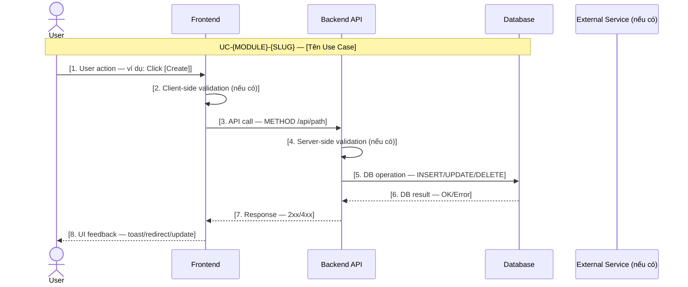
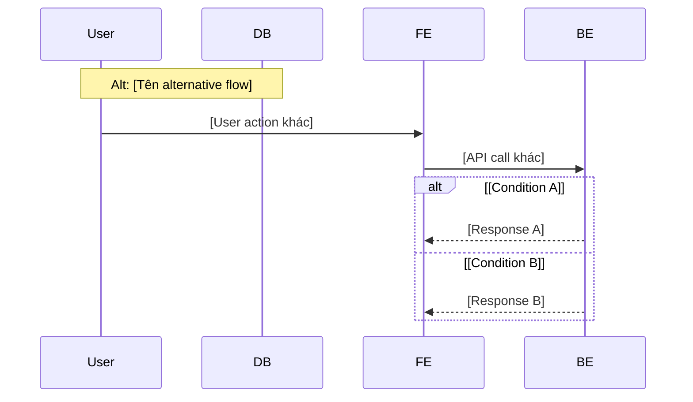

# Sequence-to-Edge-Case Template

> Template cho flow: Sequence Diagram → Break Point Analysis → Edge Case Grouping → Resolution.
> Dùng khi tạo/update UC có logic change (Lớp 4 Step 3→5).

---

## 1. Sequence Diagram

Vẽ main flow (happy path) trước. Alternative flows ghi bên dưới.

### Main Flow



### Alternative Flows (nếu có)



---

## 2. Break Point Analysis Matrix

Phân tích **MỌI interaction line** trong sequence diagram. Mỗi line có thể gãy ở đâu?

| # | Seq Step | Interaction | Break Point | Root Cause Category | Error Message (User-facing) | Severity |
|---|---|---|---|---|---|---|
| 1 | 3 | FE → BE: METHOD /api/path | Request timeout (30s) | Network | "Request timed out. Please try again." | Medium |
| 2 | 3 | FE → BE: METHOD /api/path | 401 Unauthorized | Auth | "Session expired. Please login again." | High |
| 3 | 3 | FE → BE: METHOD /api/path | 403 Forbidden | RBAC | "You don't have permission." | High |
| 4 | 4 | BE: validation | Validation failed | Input | "[field] is invalid." | Low |
| 5 | 5 | BE → DB: INSERT | Duplicate key | Constraint | "Resource already exists." | Medium |
| 6 | 5 | BE → DB: INSERT | FK violation | Constraint | "Referenced resource not found." | Medium |
| 7 | 5 | BE → DB: Operation | DB unavailable | Infra | "Service temporarily unavailable." | Critical |
| 8 | 3 | FE → BE: METHOD /api/path | 500 Internal Error | Server | "An unexpected error occurred." | Critical |

### Root Cause Categories

| Category | Mô tả | Common Breaks |
|---|---|---|
| `Network` | Vấn đề kết nối FE ↔ BE | Timeout, connection refused, DNS |
| `Auth` | Vấn đề xác thực | 401, token expired, SIWE signature invalid |
| `RBAC` | Vấn đề phân quyền | 403, role insufficient |
| `Input` | Dữ liệu đầu vào không hợp lệ | Validation failed, missing required field |
| `Constraint` | Vi phạm ràng buộc DB | Duplicate key, FK violation, check constraint |
| `Infra` | Vấn đề hạ tầng | DB down, external service unavailable |
| `Server` | Lỗi server không xác định | 500, unhandled exception |
| `Business` | Vi phạm business rule | BR-* rule blocked action |

---

## 3. Edge Case Grouping

Nhóm các break point có **cùng root cause + cùng error message** → 1 Edge Case.

| EC-ID | Name | Flow Ref | Grouped Breaks (#) | Trigger Condition | User Sees | System Does | Recovery Path |
|---|---|---|---|---|---|---|---|
| EC-{MOD}-001 | Network Timeout | UC-{ID} §main.3 | #1 | FE→BE request exceeds 30s | Toast: "Request timed out. Please try again." | Log timeout event, no DB state change | User clicks retry; FE re-sends request |
| EC-{MOD}-002 | Session Expired | UC-{ID} §main.3 | #2 | JWT token expired or invalid | Redirect to login page | Invalidate local token, clear session | User re-authenticates via SIWE |
| EC-{MOD}-003 | Insufficient Permission | UC-{ID} §main.3 | #3 | User role < required role | Toast: "You don't have permission." | Return 403, log access attempt | Admin upgrades user role |
| EC-{MOD}-004 | Duplicate Resource | UC-{ID} §main.5 | #5 | UNIQUE constraint violated | Toast: "[Resource] already exists." | Return 409, no DB mutation | User changes input value |
| EC-{MOD}-005 | Service Unavailable | UC-{ID} §main.5,7 | #7, #8 | DB outage or unhandled server error | Toast: "Service temporarily unavailable." | Log error, return 500/503 | Auto-retry after cooldown or user retry |

### EC Naming Convention

- **Format**: `EC-{MODULE}-{NNN}`
- **{MODULE}**: module slug viết HOA (ADM, POOL, EX, IB, OPR, MOB)
- **{NNN}**: 3-digit sequential, bắt đầu từ 001 per module
- **Flow Ref**: bắt buộc ghi `UC-{ID} §{section}.{step}` — biết EC ở luồng nào, step nào
- **Grouped Breaks**: reference # từ Break Point Analysis Matrix

---

## 4. Edge Case Resolution Detail (cho EC phức tạp)

Dùng khi EC cần mô tả chi tiết hơn bảng grouping:

```markdown
### EC-{MOD}-{NNN}: [Tên Edge Case]

**Flow Ref**: UC-{ID} §{section}
**Trigger**: [điều kiện xảy ra]
**Severity**: [Low | Medium | High | Critical]

**Sequence khi gãy:**

1. User thực hiện [action]
2. FE gửi request tới BE
3. ❌ [Break point xảy ra — mô tả cụ thể]
4. BE trả về [error response]
5. FE hiển thị [error UI]

**User thấy:**
- Error message: "[nội dung message]"
- UI state: [loading → error state, button disabled, etc.]

**System xử lý:**
- [Log action]
- [DB state: no change / rollback]
- [Notification (nếu có)]

**Recovery:**
- User: [action user cần làm]
- System: [auto-retry? escalate?]
- Timeout: [bao lâu trước khi auto-recover?]
```

---

## 5. Compiled EC Table (Tổng hợp cho Change Manifest)

Sau khi phân tích xong tất cả UCs trong scope, tổng hợp:

| EC-ID | Name | Module | Flow Ref | Severity | User Message | Recovery |
|---|---|---|---|---|---|---|
| EC-ADM-001 | Network Timeout | admin | UC-IB-CREATE §main.3 | Medium | "Request timed out" | User retry |
| EC-ADM-002 | Session Expired | admin | UC-IB-CREATE §main.3 | High | Redirect login | Re-auth |
| EC-ADM-003 | Duplicate IB Code | admin | UC-IB-CREATE §main.5 | Medium | "Code already exists" | Change input |

> Bảng này copy vào Change Manifest §Edge Cases.

---

## Changelog

| Date | Author | Change |
|---|---|---|
| 2026-07-17 | @hien.duong + AI | Initial version — template with Mermaid support |
