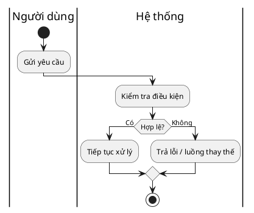

# Tài liệu yêu cầu chức năng (Functional Requirements Document)

**Dự án (Project):** [Tên dự án]
**Phiên bản (Version):** [v1.0]
**Chủ sở hữu (Owner):** [BA owner]
**Ngày (Date):** [YYYY-MM-DD]

> **Mục tiêu tài liệu:** Đặc tả yêu cầu ở tầng nghiệp vụ (business level) để khách hàng/stakeholder đọc và nắm bối cảnh. Tài liệu này **không chứa** chi tiết kỹ thuật (API, field-level data, NFR số liệu, AC step-by-step) — các phần đó thuộc SRS (xem `linked_srs`).

## Tổng quan chức năng (Functional Overview)
Mô tả giải pháp cần thực hiện dưới góc độ kinh doanh.

## Chân dung người dùng (User Personas)
| Persona | Mục tiêu (Goals) | Điểm đau (Pain Points) | Tiêu chí thành công (Success Criteria) |
| --- | --- | --- | --- |
| [Persona] | [Mục tiêu] | [Điểm đau] | [Tiêu chí] |

## Danh sách tính năng (Feature List)

> **Compiled từ `backbone_ref` §Bản đồ tính năng và phạm vi, lọc theo `Linked Module = {module_id}`.** Feature ID, Mô tả, Ưu tiên lấy nguyên từ backbone — KHÔNG tự đặt Feature ID mới hay sửa nội dung ở đây. Nếu phát sinh feature mới trong lúc làm module, phải bổ sung ngược lên backbone trước, sau đó mới compile xuống đây. Chi tiết hành vi/flow nằm ở Use Case; Acceptance Criteria dạng checklist rút gọn nằm ở User Story tương ứng.

| Feature ID | Tính năng (Feature) | Ưu tiên (MoSCoW) | Mô tả nghiệp vụ (1-2 câu) | UC Ref(s) |
| --- | --- | --- | --- | --- |
| F-01 | [Tên tính năng] | [Must/Should/Could] | [Mô tả ngắn, không đi vào flow] | UC-{module}-{slug} |

## Luồng nghiệp vụ (Workflows)

> **Scope:** Chỉ vẽ luồng nghiệp vụ tổng thể, **cross-role / cross-system** (ai làm gì, chuyển giao giữa các vai trò/hệ thống ở đâu). **KHÔNG** mô tả chi tiết tương tác actor↔system của từng use case cụ thể — phần đó thuộc UC Main Flow. **KHÔNG** mô tả luồng dữ liệu giữa các hệ thống — phần đó thuộc SRS DFD.

Sử dụng PlantUML activity diagram có swimlane khi cần thể hiện trách nhiệm chéo vai trò/hệ thống. Với luồng đơn giản, có thể dùng Mermaid flowchart.

## Quy tắc nghiệp vụ (Business Rules)

> Đây là bảng **tham chiếu**, không phải nơi định nghĩa rule. Full rule statement chỉ tồn tại ở `02_backbone/common-rules.md`. Không copy lại nội dung rule vào đây.

| Rule Code | Tác động nghiệp vụ (1 dòng, phi kỹ thuật) | Ref |
| --- | --- | --- |
| CR-VAL-01 | [Ảnh hưởng gì tới người dùng/nghiệp vụ] | `02_backbone/common-rules.md#CR-VAL-01` |

## Điểm tích hợp (Integration Points)

> **Macro level only** — chỉ nêu hệ thống nào cần liên kết và mục đích/ràng buộc nghiệp vụ (vd: SLA đối tác, cutoff time, hợp đồng). Chi tiết kỹ thuật (API/protocol/payload/dependency kỹ thuật) thuộc SRS §API/Integration Constraints — không lặp lại ở đây.

| Hệ thống (System) | Mục đích nghiệp vụ (Business Purpose) | Ràng buộc nghiệp vụ (vd: SLA, cutoff, hợp đồng) | SRS Ref |
| --- | --- | --- | --- |
| [Sàn/Đối tác X] | [Mục đích] | [Ràng buộc] | SRS §API/Integration Constraints |

## Bảng truy vết (Traceability Summary)

> Điền dần khi UC được viết. Chỉ 2 tầng ID trong toàn bộ bộ tài liệu: `FEAT-` (nghiệp vụ, sinh ở đây) → `UC-` (kỹ thuật, chi tiết đầy đủ). Không có tầng `FR-id` riêng — dev/test trace trực tiếp bằng UC ID.

| Feature ID | UC ID(s) |
| --- | --- |
| F-01 | UC-{module}-{slug} |

## Tài liệu liên quan (Related Templates)
- [SRS Spec Template](./srs-spec-template.md) — chi tiết kỹ thuật đầy đủ
- [Use Case Template](./usecase-item-template.md) — chi tiết hành vi + AC
- [Intake Form Template](./intake-form-template.md)
