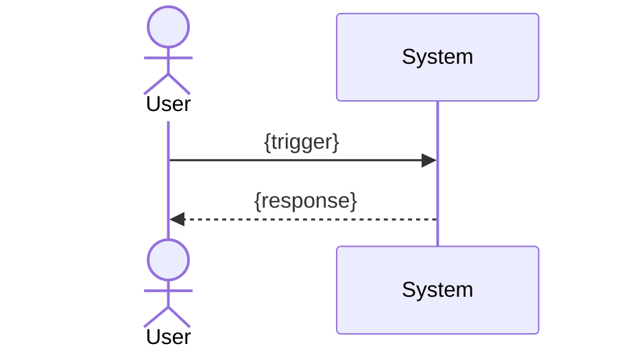

# UC-{module}-{slug}: {use case title}

> Đây là nguồn duy nhất mô tả hành vi kỹ thuật (flow, diagram, cross-function impact) của tính năng này. Story Statement sống ở User Story tương ứng (viết trước, không lặp lại ở đây). **Quy ước điều hướng:** dùng chung số thứ tự trong tên file với US tương ứng để dễ tra cứu 2 chiều, vd: `uc-01-wallet-detail.md` ↔ `us-01-wallet-detail.md`. Trace lên FRD Feature nằm ở frontmatter phía trên (`feature_ref`) — không lặp lại trong body. UC ID (`usecase_id`) chính là code dùng để trace test case/code, không cần thêm requirement ID riêng.

## Actors

- Primary: {actor}
- Secondary: {actor} (if applicable)

## Preconditions

- {precondition 1}

## Trigger

{What initiates this use case.}

## Main Flow

> Đây là nguồn đầy đủ của Acceptance Criteria. Bản rút gọn dùng cho QC checklist nằm ở User Story tương ứng (mỗi AC = 1 dòng rút gọn từ 1 step ở đây) — khi sửa flow, phải cập nhật lại AC ở US.

1. {step 1 — actor action}
2. {step 2 — system response}
3. {step 3}

## Alternate Flows

### AF-01: {alternate scenario}

1. {step}

## Error / Exception Flows

### EF-01: {error scenario}

1. {step}
2. System shows {MSG-ERR-NN}.

## Postconditions

> Definition of Done cho use case này.

- {postcondition 1}

## Cross-Function Impact

### Within Module

<!-- Replace example rows with actual dependencies, or keep "None" if no dependencies exist. -->
| Direction | UC | Data / State | Type |
|-----------|-----|--------------|------|
| None | — | — | — |

### Across Modules

<!-- Replace example rows with actual dependencies, or keep "None" if no cross-module dependencies exist. -->
| Direction | Target Module | Expected UC / Backbone Ref | Data / State | Type |
|-----------|---------------|---------------------------|--------------|------|
| None | — | — | — | — |

**Dependency Types:** `Input` (this UC needs data from another), `Output` (this UC produces data another needs), `Shared State` (both read/write same entity).

## Diagram

> **Scope:** Sequence diagram mô tả tương tác actor↔system **chỉ trong phạm vi UC này**. KHÔNG lặp lại business workflow tổng thể (xem FRD Workflows) hay data flow giữa các hệ thống (xem SRS DFD).

## Open Questions

- [ ] OQ-1: {question}
